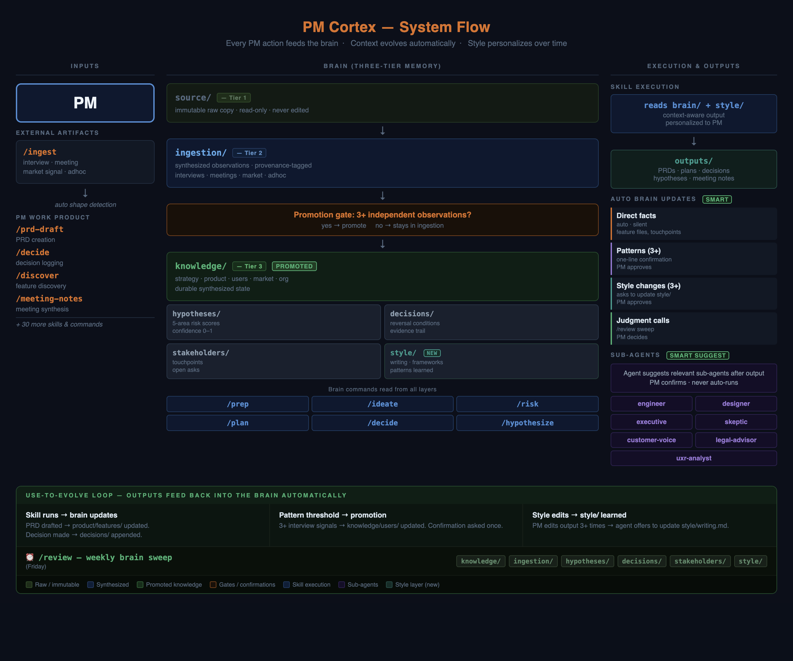

# Architecture Overview

PM Cortex is a unified product management operating system — one plugin, one brain, one system. There are no separate plugin bundles or plugin domains to manage.

## System Diagram



## System Architecture

```
┌─────────────────────────────────────────────────────────────────────┐
│                          PM CORTEX                                   │
│                   (single plugin: cortex)                          │
├──────────────────────┬──────────────────────┬────────────────────────┤
│   CONTEXTUAL MEMORY  │  ORCHESTRATED         │  SPECIALIST            │
│   (Brain Layer)      │  COMMANDS             │  REVIEWERS             │
│                      │                       │                        │
│  brain/              │  45 commands          │  7 sub-agents          │
│  ├── source/         │  ├── Daily (8)        │  ├── engineer          │
│  │   immutable       │  ├── Weekly (6)       │  ├── designer          │
│  ├── ingestion/      │  ├── Sprint (14)      │  ├── executive         │
│  │   synthesized     │  ├── Occasional (11)  │  ├── legal-advisor     │
│  └── knowledge/      │  └── Strategic (6)    │  ├── customer-voice    │
│      tiered          │                       │  ├── skeptic           │
│                      │  8 auto-skills        │  └── uxr-analyst       │
│  hypotheses/         │  (agent-invoked)      │                        │
│  decisions/          │                       │  Suggested after       │
│  stakeholders/       │                       │  significant outputs   │
│  style/              │                       │  PM confirms to run    │
└──────────────────────┴──────────────────────┴────────────────────────┘
                                   ↑
                         Claude Desktop CLI
```

## The Brain: Three-Tier Memory

**Purpose:** Persistent context across every session

**Tier 1 — `brain/source/`**
Immutable raw copies of every artifact. Never edited. Serves as the audit trail.

**Tier 2 — `brain/ingestion/`**
Synthesized, provenance-tagged observations. Each artifact is classified by shape (interview, meeting, market signal, adhoc) and routed here after `/ingest`.

**Promotion Gate**
Knowledge claims carry a `Tier:` marker. Operator assertions and single-source signals enter as `Tier: stated`; a claim is promoted to `Tier: confirmed` only after 3+ *independent, external* sources confirm the same pattern (operator reiteration and same-population signals don't count). The gate governs *confirmation*, not entry — so a stated claim never masquerades as verified, and in the evidence hierarchy it ranks below direct customer evidence.

**Tier 3 — `brain/knowledge/`**
Durable synthesized state — strategy, product, users, market, org. Evidence-bearing files are tagged `Tier: stated` or `Tier: confirmed`. This is what commands draw on when generating outputs.

**Supporting Layers**
- **`brain/hypotheses/`** — Feature-level risk scores across 5 areas (value, usability, feasibility, viability, other), with confidence 0–1 and decision triggers
- **`brain/decisions/`** — Append-only log with reversal conditions and evidence trail
- **`brain/stakeholders/`** — Touchpoints, open asks, last unresolved concern per person
- **`brain/style/`** — PM's writing patterns, preferred frameworks, communication style. Learned over time. Updated when the PM edits outputs 3+ times in the same direction.

**Core Loop:**
1. Artifact arrives → `/ingest` → `brain/source/` (immutable copy)
2. Synthesize → `brain/ingestion/` (observations tagged with provenance)
3. Check promotion gate → if 3+ independent observations, promote → `brain/knowledge/`
4. Maintain → Weekly `/review` sweep across all layers

**Provenance System:**
Every claim carries a source tag:
- `[ingestion/<path>]` — Documented (highest trust)
- `(stakeholder-verbal, name, date)` — Verbal
- `(intuition, PM, date)` — Intuition
- `(industry-knowledge)` — Background

## Commands: Orchestrated Workflows

**Purpose:** Guided, repeatable PM workflows that are brain-aware

All 45 commands share a common pattern:
1. Load relevant brain context
2. Execute structured multi-step workflow
3. Update brain with outputs

Commands are organized by cadence:

| Cadence | Count | Examples |
|---|---|---|
| Daily | 8 | `/ingest`, `/prep`, `/daily-plan`, `/meeting-notes` |
| Weekly | 6 | `/review`, `/weekly-plan`, `/weekly-review`, `/status-update` |
| Sprint | 14 | `/prd-draft`, `/sprint`, `/retro`, `/plan-okrs`, `/prioritize` |
| Occasional | 11 | `/discover`, `/decide`, `/risk`, `/ideate`, `/hypothesize` |
| Strategic | 6 | `/define-north-star`, `/expansion-strategy`, `/gtm-strategy` |

## Skills: Domain-Specific Expertise

**Purpose:** Focused PM frameworks loaded automatically by the agent

Eight skills are invoked transparently by the agent based on the task context. The PM does not select them directly. Examples: OKR brainstorming, experiment design, ICP definition, impact sizing, competitor analysis.

## Sub-Agents: Specialist Reviewers

**Purpose:** Multi-perspective evaluation of significant PM outputs

Seven agents, each with a distinct persona: engineer-reviewer, designer-reviewer, executive-reviewer, legal-advisor, customer-voice, skeptic, uxr-analyst.

The system suggests relevant sub-agents after PRDs, strategies, or decision documents. The PM confirms before any agent runs. All seven can be invoked simultaneously via `/prd-review-panel` for a consolidated multi-perspective review.

## Data Flow

```
Input Artifacts
  (transcripts, docs, signals)
         ↓
    /ingest
         ↓
brain/source/ ← immutable copy
         ↓
brain/ingestion/ ← synthesis + provenance tags
         ↓
    Promotion Gate (stated → confirmed, 3+ independent sources)
         ↓
  ┌──────┴────────┬──────────┬──────────────┐
  ↓               ↓          ↓              ↓
knowledge/  hypotheses/  decisions/  stakeholders/
         ↓
    Weekly /review sweep
         ↓
  Flags stale content · Suggests updates · Archives resolved items
```

## Folder Structure

```
your-product-brain/                (scaffolded by /pm-brain)
├── CLAUDE.md                      (brain-aware system prompt)
├── brain/                         (memory layer)
│   ├── source/                    (immutable audit trail)
│   │   ├── interviews/
│   │   ├── meetings/
│   │   ├── market/
│   │   └── adhoc/
│   ├── ingestion/                 (synthesized working memory)
│   │   ├── interviews/
│   │   ├── meetings/
│   │   ├── market/
│   │   └── adhoc/
│   ├── knowledge/                 (durable state; Tier: stated / confirmed)
│   │   ├── strategy.md
│   │   ├── product/
│   │   ├── users/
│   │   ├── market/
│   │   └── org/
│   ├── hypotheses/
│   ├── decisions/
│   ├── stakeholders/
│   └── style/
├── templates/                     (output templates)
├── outputs/                       (generated deliverables)
├── docs/                          (reference docs)
├── maintenance/                   (logs, health checks)
├── rules/                         (operating rules)
└── .claude/
    ├── commands/                  (45 command files)
    ├── skills/                    (54 skill directories)
    └── agents/                (7 sub-agent files)
```

```
~/.claude/plugins/cortex/        (plugin — installed globally)
├── commands/pm-brain.md           (init + upgrade orchestration)
├── prompts/                       (interview, migration, post-scaffold)
└── scaffold/                      (deterministic template copied on init)
```

## Design Decisions

### Why a Single Unified Plugin?

The previous architecture required installing PM Brain and then choosing from 9 separate PM Skills plugins. This created dependency management overhead and inconsistent command availability. PM Cortex ships everything in one install: the brain is initialized once, and all 45 commands are available immediately.

### Why Markdown + Git?

- Human-readable (grep, edit, read without tooling)
- Version-controlled (full history of every brain update)
- No cloud dependency, no vector DB complexity
- Portable — survives tool changes

### Why Local-First?

- You own the data
- Works offline
- No API keys for the memory layer
- No privacy concerns

### Why Three Memory Tiers?

The promotion gate prevents premature knowledge calcification, and the `stated`/`confirmed` tier keeps it honest in both directions. A single customer quote should not, by itself, rewrite your core strategy — but neither should a `stated` assumption you typed in at setup outrank that customer. Three independent external observations represent a pattern worth trusting (`confirmed`); until then, a claim stays `stated` and yields to direct customer evidence. The system enforces both automatically.

## Next Steps

- [PM Brain Guide](pm-brain-guide.md) — Memory layer deep dive
- [Integration Guide](integration-guide.md) — Workflow patterns
- [Quickstart Guide](quickstart.md) — Get started
